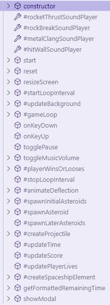
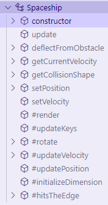
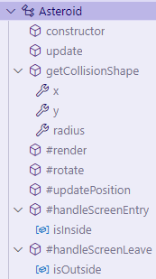
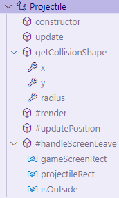
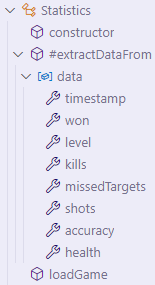
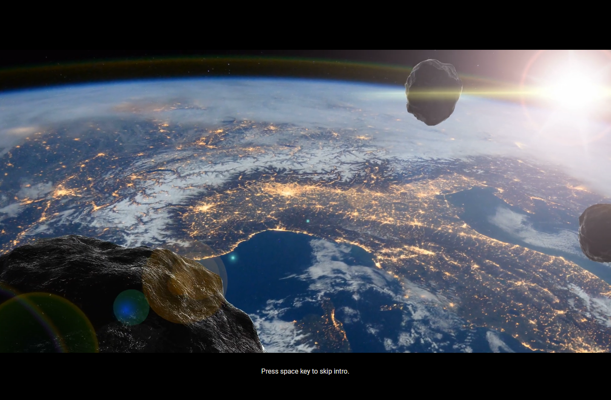
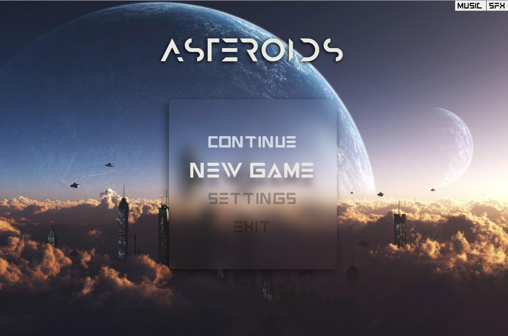
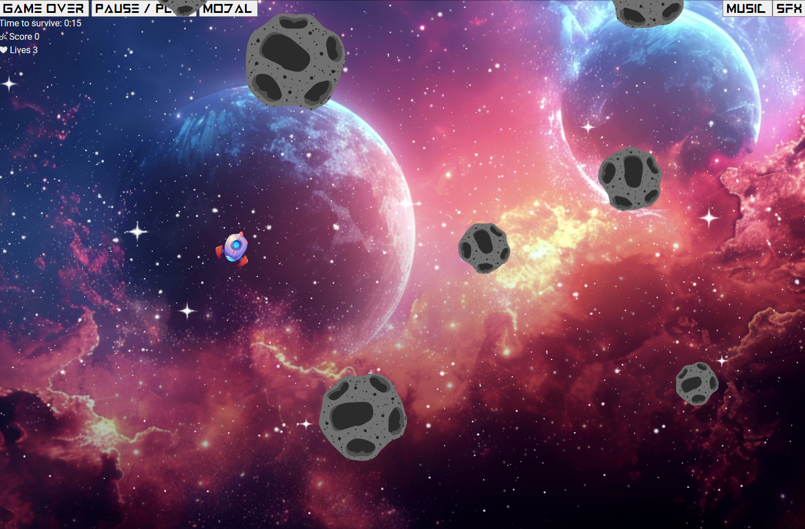
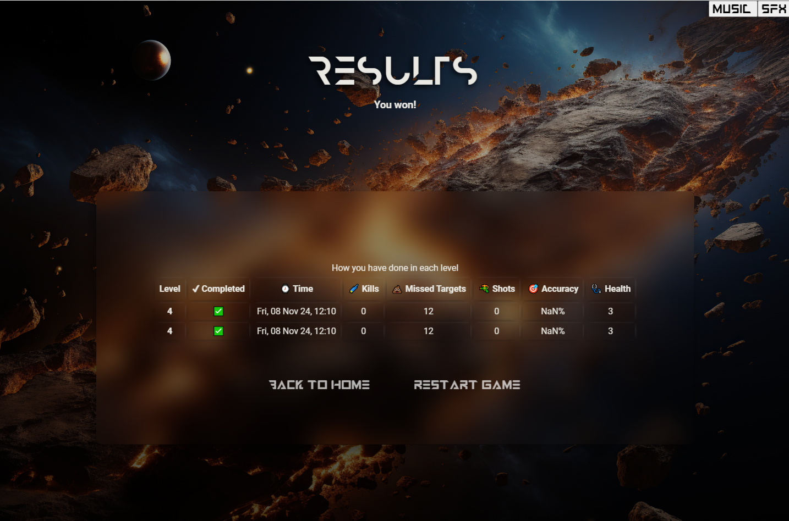

# Project's name

[Click here to see deployed game](https://mrfootwork.github.io/project-asteroids/)

## Description
The projects recreates the famous game Asteroids, which was released by Atari in 1981. The player controls a spaceship on a screen. Asteroids coming in from all sides can be shot into smaller pieces. The player loses, if he loses all his lives by bumping into asteroids too often.

## Game Controls
| Key       | Action                        |
| :-------: |:------------------------------|
| W, 🔼     | Thrust                        |
| A, ◀      | Rotate anti-clockwise ↪       |
| D, ▶      | Rotate clockwise ↩            |
| S, 🔽     | Breaks                        |
| Space     | Shoots projectiles            |
| P, Pause  | Pauses and resumes the game   |

## MVP
- [x] Start game
- [x] Player can shoot asteroids
- [x] Asteroids keep spawning into the screen
- [x] Asteroids take players lives until he dies
- [x] Player loses, if he has no lives left
- [x] Player wins, if he survives
- [x] After the game ends, the game can be restarted

## Backlog
### Gameplay

- [x]  spawn progression
- [x]  time to survive
- [x]  substract lives
- [x]  count score
- [x]  ‼properly reset game states for new games
- [x]  🐞 Taste P funktioniert nach game restart nicht
- [x]  🐞 set base url on paths
- [x]  🐞 keep ship in bound
- [x]  🐞 reset orientation and velocity
- [x]  🐞 when sfx is switched off, I can still make shooting sounds, sometimes (like every 2nd time I shoot)
- [ ]  🐞 firerate is always high, regardless of value set
Conditional check is with timestamps (ms) 
🧠 Think of a solution, what unit is best
- [ ]  weapon cooldown
- [ ]  weapon overheat
- [ ]  shield bar instead of lives
- [ ]  asteroid hitpoints
- [ ]  break big asteroid into small pieces
- [ ]  powerups
- [ ]  weapons
- [ ]  define asteroid types
- [x]  create level progression
- [ ]  organize background image data with all settings for css to change according to level
- [ ]  asteroids deflect each other
- [ ]  items, shop & currency
- [ ]  🐞fine-tune collision shapes
- [ ]  🐞🐞🐞 can’t thrust after 
pause → game over → restart
also: doing that you can thrust on the Result Screen…
in general: The game seems to keeps running after game over

### UI/UX

- [x]  ‼build main menu
- [x]  lower sound volume of backgroundmusic  (on 28)
- [x]  menu buttons: sound on hover
- [x]  sounds: explosion, thrust, asteroid contact
- [x]  add text shadow to title
- [x]  disable user-select on title
- [ ]  animate explosion, thrust
- [ ]  animate bumping into asteroid (reuse hit edge animation)
- [x]  ‼Show an immediate dialog when game finishes
- [x]  🐞 dialog shows victory, although I die…
- [x]  🐞 never display negative numbers!
- [x]  ‼ Pause Dialog
- [ ]  add victorious short musik on level completion
- [ ]  🐞 on DEFEAT: try again shoud maintain levelID
- [ ]  🐞 on Pause: intercept ESC to also resume game
- [ ]  ‼build result display (win/lose)
- [ ]  ‼build game UI: with shield, speed, gun cool down, overheat, current Level
- [x]  indicate when pausing the game
- [ ]  indicate, that player was hit
- [ ]  on bump: deflect from asteroid, asteroid should stay
- [ ]  show intro text with a level explanation (maybe with typewriter text)
- [ ]  collect statistics
    - shots hit/miss
    - count asteroids hit and group in categories
- [ ]  ‼at game start: transition to game with animation (fancy loading screen?)
- [ ]  
- [ ]  add transitions between video changes (align with beats)
- [x]  basic settings (music/sfx)

### Performance

- [ ]  transition between views
- [ ]  audio pooling (see TODO)
- [ ]  🐞 game view: start rendering only everything is loaded
- [ ]  🐞 remove asteroid element correctly at screen leave
- [ ]  🐞 click on intro videos shouldn’t restart videos
- [ ]  fine tune velocity of spawning asteroids
- [ ]  🐞 Fix lagging asteroids spawn
    - ~~hide in hidden container~~
    - ~~hide outside screen and render later~~
    - reuse elements and use an element pool
    

### Backlog

- [ ]  settings
    - sounds fine control
    - game controls
    - ...
- [ ]  multiplayer
- [ ]  use reactive values

## Data structure
### Classes
- Game
- Spaceship
- Asteroid
- Projectile
- Statistics

#### Game Class

#### Spaceship Class

#### Asteroid Class

#### Projectile Class

#### Statistics Class

## States y States Transitions
### Intro

### Home

### Game

### Result

## Task
- 🌌 Setup views and cycle through them
- 🔃 Setup game on game view and define a game loop
- 🚀 Show spaceship and add controls
- 🎮 Show asteroids and add random movements
- 🔫 Allow spaceship to shoot
- 🔂 Setup level progression
- 🛑 Detect collisions and handle them
- 🚥 Display game stats, e.g. lives, kills, time
- 🏆 Define winning and losing conditions
- 📈 Add statistics and display them on the result view
- 🍭 Add all the other good stuff

## Links

- [Slides Link](https://docs.google.com/presentation/d/1twygpWXAByjSrPZs7Sx-PUHpiEzXlUVhO3skZOzlV1Q/edit?usp=drive_link)
- [Github repository Link](http://github.com/MrFootwork/project-asteroids)
- [Live Demo](https://mrfootwork.github.io/project-asteroids/)
